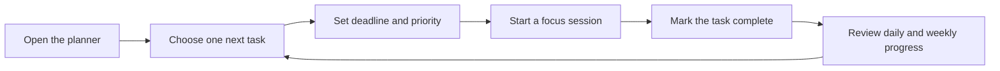
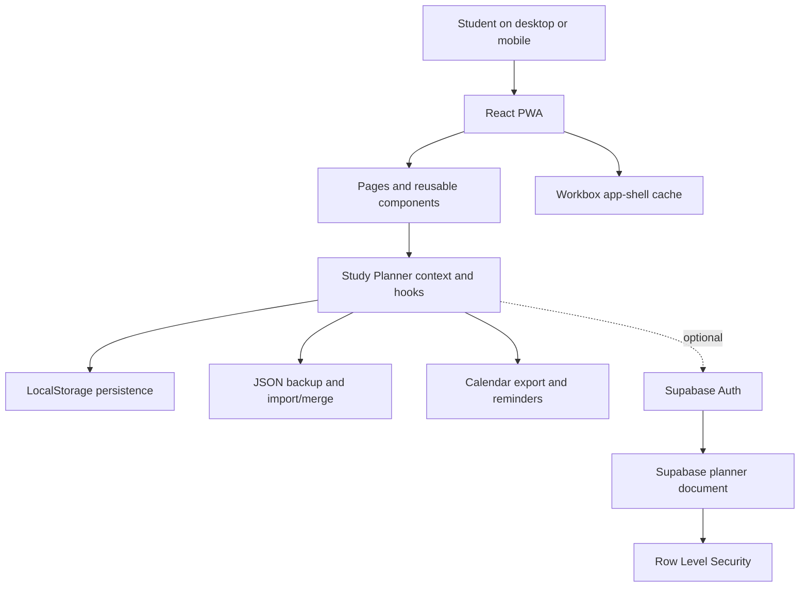

<div align="center">


# Student Study Planner

### A calm, mobile-first workspace for focused study

Plan the next step, protect your focus, and see your progress build over time.

<p>
  <a href="https://studyflow-pwa.vercel.app/"></a>
  <a href="https://github.com/yashrajagawane/studyflow-pwa"></a>
</p>


</div>

<a id="top"></a>

## Contents

- [About](#about)
- [Product showcase](#product-showcase)
- [The problem](#the-problem)
- [The solution](#the-solution)
- [Feature map](#feature-map)
- [Daily workflow](#daily-workflow)
- [Design system](#design-system)
- [Technology stack](#technology-stack)
- [Architecture](#architecture)
- [Project structure](#project-structure)
- [Getting started](#getting-started)
- [Optional cloud sync](#optional-cloud-sync)
- [Free deployment](#free-deployment)
- [Privacy and data](#privacy-and-data)
- [Project status](#project-status)
- [Contributing](#contributing)

## About

Student Study Planner is a free, installable Progressive Web App for students who want a simple daily system without a subscription, mandatory account, or distracting social features.

It is local-first by default: the planner works immediately in the browser and keeps tasks and study sessions on the device. Optional Supabase authentication and synchronization can be enabled when a user wants the same planner across browsers.

<div align="center">

**Plan clearly** &nbsp; `Tasks` &nbsp; **Focus intentionally** &nbsp; `Sessions` &nbsp; **Improve consistently** &nbsp; `Progress`

</div>

## Product showcase

The interface uses a Midnight Indigo visual language: deep blue-black surfaces, indigo actions, cyan accents, soft borders, and readable contrast for long study sessions.

### Desktop dashboard

<p align="center">
  
</p>

### Mobile-first experience

<p align="center">
  
</p>

### Core screens

<table>
  <tr>
    <td width="50%">
      <h3>Dashboard</h3>
      <p>A quick read of today's focus, completion progress, upcoming work, overdue work, and weekly momentum.</p>
    </td>
    <td width="50%">
      <h3>Tasks</h3>
      <p>Turn broad study goals into clear next steps with deadlines, priorities, subjects, notes, and recurrence.</p>
    </td>
  </tr>
  <tr>
    <td width="50%">
      <h3>Schedule</h3>
      <p>Plan timed study sessions, sort the week, and export sessions as an iCalendar file.</p>
    </td>
    <td width="50%">
      <h3>Progress</h3>
      <p>See daily and weekly completion, active streaks, longest streaks, and the habits behind the numbers.</p>
    </td>
  </tr>
</table>

## The problem

Study plans often fail for practical reasons: goals are too broad, the next action is unclear, progress is hard to see, and the planning tool itself becomes another distraction. Students also need a reliable experience that works on a phone, does not require a paid account, and does not lose their work when connectivity changes.

## The solution

Study Planner turns a study goal into a small, visible loop:

```text
Choose the next task  ->  Schedule focused time  ->  Complete the work  ->  Learn from progress
        ^                                                                    |
        └────────────────────── Adjust the next plan ────────────────────────┘
```

The result is deliberately practical: fewer planning decisions, clearer next actions, and a progress view based on real completed work rather than empty goals.

## Feature map

| Area | What is included |
| --- | --- |
| Task planning | Create, edit, complete, delete, search, filter, sort, and categorize tasks |
| Task detail | Subjects, priorities, deadlines, notes, overdue states, and daily/weekly recurrence |
| Scheduling | Timed study sessions with add, edit, sort, delete, and calendar export |
| Focus | Client-side 25-minute focus timer with task selection |
| Progress | Daily progress, weekly bars, current streak, longest streak, and completion summaries |
| Reliability | LocalStorage persistence, JSON backup export/import, merge flows, and clear-data confirmation |
| Reminders | Optional foreground browser reminders while the app is open |
| Cloud | Optional Supabase email authentication and latest-record-wins synchronization |
| PWA | Service-worker app shell, responsive navigation, install prompt, and offline-friendly local mode |
| Accessibility | Semantic controls, visible keyboard focus, labels, confirmation states, and reduced-motion support |

## Daily workflow



### Typical student flow

1. Open the dashboard and identify the most useful next action.
2. Add or refine a task with a subject, deadline, priority, and notes.
3. Schedule a study session or start the 25-minute focus timer.
4. Complete the task and let the dashboard update automatically.
5. Review the Progress page at the end of the day or week.
6. Export a backup or enable cloud sync when the planner needs to move to another device.

## Design system

Midnight Indigo keeps the app focused and calm rather than overly bright:

| Token | Value | Use |
| --- | --- | --- |
| Background | `#080B14` | Page and app shell |
| Surface | `#111827` | Panels, cards, and navigation surfaces |
| Elevated surface | `#182235` | Buttons, inputs, and selected controls |
| Primary | `#7C9CFF` | Main actions, progress, and active states |
| Accent | `#67E8F9` | Focus accents and visual highlights |
| Text | `#F4F7FF` | Headings and high-priority content |
| Muted text | `#93A4BF` | Supporting descriptions and metadata |

The same palette is used in the interface, PWA manifest, browser theme color, and home-screen icon.

## Technology stack

| Layer | Technology |
| --- | --- |
| UI | React 19 and JavaScript |
| Build | Vite 8 |
| Styling | CSS with Tailwind CSS tooling |
| PWA | vite-plugin-pwa and Workbox |
| Local data | Browser LocalStorage |
| Optional cloud | Supabase Auth and Postgres |
| Hosting | Vercel Hobby tier |
| Source control | GitHub |

<p>
  
  
  
  
  
</p>

## Architecture



### Design decisions

- **Local-first:** the core product does not depend on a server or login.
- **Progress from data:** dashboard and streak values are derived from completed tasks and sessions.
- **Optional cloud:** sync is an enhancement, not a requirement for using the planner.
- **Safe recovery:** backups and merge flows reduce the risk of losing a personal study plan.
- **Mobile priority:** installability, responsive navigation, touch-sized controls, and offline-friendly behavior are part of the core experience.

## Project structure

```text
src/
├── components/       Reusable layout, navigation, task, schedule, and common UI
├── context/           Shared planner state and provider
├── hooks/             Persistence, task actions, reminders, and cloud sync
├── pages/             Dashboard, Tasks, Schedule, Progress, and Settings
├── services/          Storage, backup, calendar, Supabase, and sync services
├── utils/             Dates, validation, progress, and schedule rules
├── App.jsx            Application navigation and page composition
└── main.jsx           React entry point and PWA registration
public/
└── icons/pwa-icon.svg Midnight Indigo app icon used by the PWA
supabase/
└── schema.sql         Database schema and row-level security policies
docs/
├── preview-dashboard.png
└── preview-mobile.png
```

## Getting started

### Requirements

- Node.js 20 or newer
- npm
- A modern browser

### Install and run

```bash
git clone https://github.com/yashrajagawane/studyflow-pwa.git
cd studyflow-pwa
npm install
npm run dev
```

Open the local URL printed by Vite.

### Verify a production build

```bash
npm run lint
npm run build
npm run preview
```

The build generates the web manifest and service worker. The most accurate installation test uses the deployed HTTPS URL on Chrome Android or Safari iOS.

## Optional cloud sync

The local-only experience works without any environment variables. To enable Supabase synchronization:

1. Create a free Supabase project.
2. Run [`supabase/schema.sql`](supabase/schema.sql) in the Supabase SQL Editor.
3. Copy [`.env.example`](.env.example) to `.env.local`.
4. Add the project URL and publishable/anonymous key:

   ```env
   VITE_SUPABASE_URL=https://your-project.supabase.co
   VITE_SUPABASE_ANON_KEY=your-publishable-key
   ```

5. Restart Vite, open **Settings**, create an account, and select **Sync now**.

The planner document is protected with Row Level Security. Never place a Supabase service-role or secret key in this frontend.

## Free deployment

The complete free deployment path is:

```text
GitHub  ->  Vercel Hobby tier  ->  public HTTPS URL  ->  installable PWA
```

Recommended Vercel settings:

```text
Framework: Vite
Install command: npm install
Build command: npm run build
Output directory: dist
```

No paid domain, paid API, paid database plan, or app-store publication is required.

## Privacy and data

Without Supabase configuration, tasks and sessions stay in the current browser. With optional cloud sync, only the signed-in user's planner document is stored in Supabase and protected by Row Level Security.

Settings includes:

- Local JSON backup export and import.
- Merge flows for restoring or combining planner data.
- Explicit confirmation before clearing all local data.
- Sign-in, sync, and sign-out controls for optional cloud mode.

## Project status

| Milestone | Status |
| --- | --- |
| Core local-first planner | Complete |
| Tasks, schedules, progress, streaks, and focus timer | Complete |
| Recurring tasks, calendar export, and foreground reminders | Complete |
| Free Vercel deployment and PWA installation | Complete |
| Supabase authentication and cloud synchronization | Complete |
| Multi-device conflict summary | Complete |
| Midnight Indigo redesign and themed PWA icon | Complete |
| Mobile install prompt | Complete |

Possible future enhancements include richer per-record conflict resolution, background push notifications, automated end-to-end tests, and optional AI-assisted study planning.

## Contributing

Contributions and thoughtful product feedback are welcome.

```bash
git clone https://github.com/yashrajagawane/studyflow-pwa.git
cd studyflow-pwa
git checkout -b feature/your-improvement
npm install
npm run lint
npm run build
```

Keep changes focused, preserve the local-first behavior, and include a clear description in the pull request.

## License

This project does not currently include a license file. Add an explicit license, such as MIT, before distributing or accepting broad external contributions.

## Links

<div align="center">

<a href="https://studyflow-pwa.vercel.app/"></a>
<a href="https://github.com/yashrajagawane/studyflow-pwa"></a>

<br />
<br />

Built as a portfolio project by [Yashraj Agawane](https://github.com/yashrajagawane).

<br />

**Focus clearly. Learn consistently. Grow every day.**

</div>

<p align="center">
  
</p>

[Back to top](#top)
