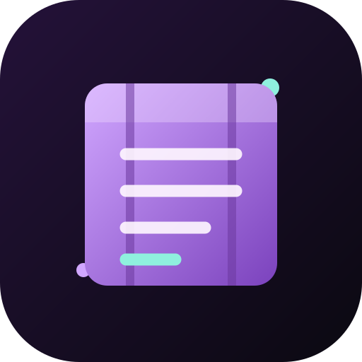
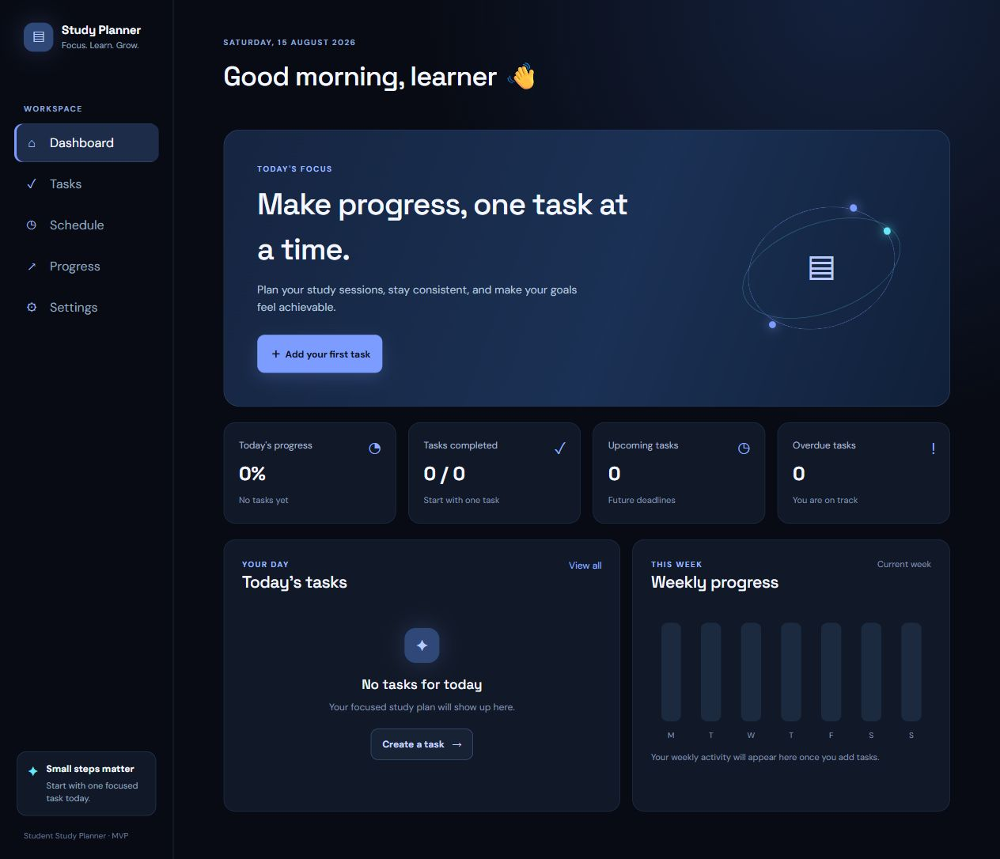
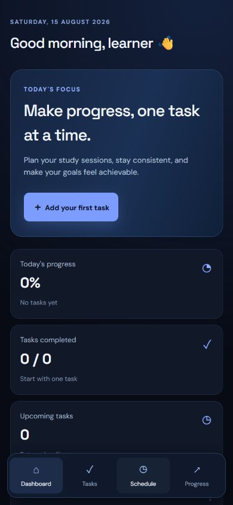

# Student Study Planner

<p align="center">
  <strong>A calm, mobile-first study planner for turning goals into consistent progress.</strong><br />
  Plan tasks, schedule focused sessions, track progress, and keep your study data yours.
</p>

<p align="center">
  <a href="https://studyflow-pwa.vercel.app/"></a>
  <a href="https://github.com/yashrajagawane/studyflow-pwa"></a>
</p>

<p align="center">
  
</p>

## Preview

The interface uses a Midnight Indigo theme: deep blue-black surfaces, indigo actions, cyan accents, and high-contrast text designed for long study sessions.

<p align="center">
  
</p>

<p align="center">
  
</p>

## Why it exists

Student Study Planner is a free installable PWA built for students who want a simple daily system without a paid subscription, mandatory account, or distracting social features.

- Start immediately with local-only storage.
- Add optional Supabase sync when you want access across browsers.
- Install it from the HTTPS site and use it like a native mobile app.
- Export a local JSON backup whenever you want a portable copy of your data.

## Features

### Planning

- Create, edit, complete, and delete study tasks.
- Add subjects, priorities, deadlines, notes, and recurrence rules.
- Search by title, subject, or notes.
- Filter by today, upcoming, completed, overdue, priority, and subject.
- Sort by deadline, priority, title, or date added.

### Progress and focus

- Dashboard summary for today's progress, completed tasks, upcoming work, and overdue work.
- Daily and weekly progress calculated from real task data.
- Current and longest study streaks.
- Client-side 25-minute focus timer.
- Timed study sessions with add, edit, sort, and delete controls.

### Reliability and privacy

- LocalStorage persistence across refreshes and reopening.
- Local JSON export, import, and merge flows.
- Explicit confirmation before clearing all data.
- Optional foreground browser reminders while the app is open.
- Optional Supabase authentication and cloud synchronization.
- Latest-record-wins conflict handling with a visible sync summary.

### Installable mobile app

- Responsive layout with mobile navigation.
- PWA manifest and service-worker app-shell caching.
- Mobile install prompt with native Android/Chrome installation.
- iPhone/iPad guidance for Safari's **Add to Home Screen** flow.
- Midnight Indigo icon and browser theme color.

## Tech stack

| Layer | Technology |
| --- | --- |
| UI | React 19, JavaScript |
| Build | Vite 8 |
| Styling | CSS with Tailwind CSS tooling |
| PWA | vite-plugin-pwa, Workbox |
| Local data | Browser LocalStorage |
| Optional cloud | Supabase Auth and Postgres |
| Hosting | Vercel Hobby tier |
| Source control | GitHub |

## Architecture

```text
src/
├── components/       Reusable layout, navigation, task, schedule, and common UI
├── context/          Shared planner state and provider
├── hooks/            Persistence, task actions, reminders, and cloud sync
├── pages/            Dashboard, Tasks, Schedule, Progress, and Settings
├── services/         Storage, backup, calendar, Supabase, and sync services
├── utils/            Dates, validation, progress, and schedule rules
├── App.jsx           Application navigation and page composition
└── main.jsx          React entry point and PWA registration
```

## Run locally

Requirements: Node.js 20 or newer and npm.

```bash
git clone https://github.com/yashrajagawane/studyflow-pwa.git
cd studyflow-pwa
npm install
npm run dev
```

Open the local URL printed by Vite. For a production-style local check:

```bash
npm run lint
npm run build
npm run preview
```

## Optional Supabase sync

The app is fully usable without Supabase. Cloud sync is enabled only when both Vite variables are present.

1. Create a free Supabase project.
2. Run [`supabase/schema.sql`](supabase/schema.sql) in the Supabase SQL Editor.
3. Copy [`.env.example`](.env.example) to `.env.local`.
4. Add the Supabase URL and publishable/anonymous key:

   ```env
   VITE_SUPABASE_URL=https://your-project.supabase.co
   VITE_SUPABASE_ANON_KEY=your-publishable-key
   ```

5. Restart Vite, open **Settings**, create an account, and choose **Sync now**.

The database table is protected with Row Level Security. Never put a Supabase service-role or secret key in this frontend.

## Free deployment

The production path is:

```text
GitHub → Vercel Hobby tier → public HTTPS URL → mobile PWA installation
```

Recommended Vercel settings:

```text
Framework: Vite
Install command: npm install
Build command: npm run build
Output directory: dist
```

No paid domain, API, database plan, or app-store publication is required.

## PWA installation

On a supported mobile browser, open the [live app](https://studyflow-pwa.vercel.app/) and use the install prompt. You can also use the browser menu and choose **Install app** or **Add to Home screen**.

For local testing, use `npm run build` followed by `npm run preview`; service workers and installation are most reliable over HTTPS on the deployed Vercel URL.

## Data and privacy

Without Supabase configuration, tasks and sessions remain in the current browser. With optional cloud sync, only the signed-in user's planner document is stored in Supabase and protected by Row Level Security. Settings provides backup export/import and clear-data controls.

## Project status

The core product, free deployment, recurring tasks, calendar export, reminders, Supabase authentication, cloud sync, conflict summary, Midnight Indigo redesign, and mobile install experience are implemented.

Possible future improvements include background push notifications, richer multi-device conflict resolution, automated tests, and optional AI-assisted study planning.

## Author

Built as a portfolio project by [Yashraj Agawane](https://github.com/yashrajagawane).
